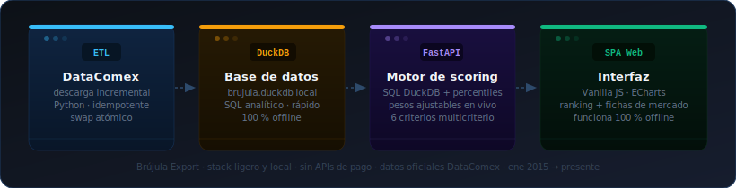

# Brújula Export

**Selección de mercados de exportación con datos oficiales DataComex — 100 % local, sin APIs de pago.**

Escribes un producto (texto o código TARIC) y la herramienta te da un ranking de países con scoring multicriterio, fichas de mercado y la cuota de Aragón/Zaragoza en esa exportación. Genera también un informe imprimible — resumen ejecutivo con los top-5 mercados y cifras clave — que puedes pegar directamente como contexto en cualquier IA externa.

> *¿Dónde debería exportar este producto?* — eso es lo que responde.

<br>

[](https://github.com/olacambraa-lgtm/brujula-export/actions/workflows/datacomex-liveness.yml)
[](LICENSE)


<br>

<p align="center">
  
</p>

---

## En un vistazo

| | |
|---|---|
| **100 % local** | Funciona sin conexión; la única acción que usa la red es actualizar los datos, y es manual |
| **Datos oficiales** | DataComex — Secretaría de Estado de Comercio · comercio declarado, ~98 % del total |
| **Scoring transparente** | 6 criterios con pesos ajustables en vivo; normalizados a percentil entre países candidatos |
| **Cuota Aragón/Zaragoza** | Desglose provincial disponible con cuenta gratuita de DataComex |
| **Datos siempre al día** | Ejecutas la actualización cuando quieras y la app refleja lo último publicado |
| **Sin build step** | SPA vanilla JS + ECharts vendorizado; funciona desde cualquier navegador moderno |

---

## Primeros pasos

```bash
git clone https://github.com/olacambraa-lgtm/brujula-export
cd brujula-export
python3 -m venv .venv && .venv/bin/pip install -r requirements.txt
```

Configura tu acceso a DataComex (ver sección siguiente) y descarga los datos:

```bash
cp .env.example .env   # pega tus credenciales dentro (ver abajo)
./update-data.sh       # descarga los datos de DataComex
./run.sh               # → http://localhost:8765
```

> ¿Quieres ver cómo funciona antes de registrarte? Ejecuta `./run.sh` directamente: si no hay datos, la app genera un **dataset de demostración** y te avisa con un banner.

---

## Configurar DataComex

La herramienta no incluye datos: cada usuario descarga los suyos con su propia cuenta de DataComex (gratuita). Sin credenciales la app funciona, pero con datos muy limitados — [ver diferencias](#con-cuenta-o-sin-cuenta).

Tienes dos formas de configurar el acceso:

### Opción A — Token (recomendado)

Es la más cómoda. El token es permanente y no hay que renovarlo.

1. **Crea una cuenta gratuita** en <https://datacomex.comercio.es/User> (correo y contraseña). Confirma el correo e inicia sesión.
2. **Obtén tu token:** en la sección de ayuda de la API de DataComex, pulsa **«Obtener Token»** y copia el texto largo que aparece.
3. **Crea tu `.env`** a partir de la plantilla:
   ```bash
   cp .env.example .env
   ```
4. Abre `.env` y pega el token en esta línea (quita la `#` del principio):
   ```
   DATACOMEX_TOKEN=eyJhbGciOi…tu-token
   ```

### Opción B — Correo y contraseña

Si prefieres no usar el token, puedes poner directamente las credenciales con las que te registraste:
```
DATACOMEX_EMAIL=tucorreo@ejemplo.com
DATACOMEX_PASSWORD=tucontraseña
```

Con cualquiera de las dos opciones, `./run.sh` y `./update-data.sh` cargan el `.env` automáticamente.

> **Privacidad:** tus credenciales viven solo en tu `.env` local, que está en `.gitignore` y nunca se sube al repositorio.

---

## Datos dinámicos

Los datos no van en el repositorio (son grandes y el ministerio los actualiza cada mes): cada usuario los descarga y los mantiene al día con `./update-data.sh`. Cuando DataComex publica un mes nuevo, basta volver a ejecutarlo.

```bash
./update-data.sh   # trae lo último de DataComex y reconstruye la base
./run.sh           # sirve los datos (offline)
```

### Flujo de datos


### Con cuenta o sin cuenta

La herramienta está diseñada para usarse **con cuenta gratuita de DataComex**. Sin cuenta también funciona, pero con importantes limitaciones:

**Sin cuenta de DataComex** — la app descarga solo datos nacionales básicos por la vía pública. No hay desglose provincial, así que el análisis de Aragón/Zaragoza desaparece por completo. Si tu objetivo es analizar el potencial exportador de empresas aragonesas, esta opción no tiene mucho sentido.

**Con cuenta gratuita de DataComex** — acceso completo: datos nacionales y provinciales (Aragón/Zaragoza), scoring con todos los indicadores, fichas de mercado sin lagunas. Es la versión para la que fue diseñada la herramienta. Registrarse es gratuito y lleva menos de 5 minutos.

Cuando ejecutas `./update-data.sh`, la app descarga solo los meses que le faltan — no empieza de cero cada vez. Para que los datos nuevos aparezcan en la app, reinicia con `./run.sh` (o `./run.sh --update` para actualizar y arrancar en un paso).

> La primera descarga por la vía pública (sin cuenta) baja todo el histórico desde 2015 y puede tardar varias horas por los límites del formulario público (~5-8 h, ~42 MB). Para un primer vistazo más rápido: `./update-data.sh --from 2022-01` (~1,5 h). Un CI opcional ([`datacomex-liveness.yml`](.github/workflows/datacomex-liveness.yml)) avisa si DataComex cambia algo que rompa la extracción.

---

## Arquitectura

| Pieza | Qué hace |
|---|---|
| `etl/` | Descarga DataComex (API oficial con token, o cadena CSV pública) y construye `data/brujula.duckdb` |
| `app/` | FastAPI: motor de scoring (SQL DuckDB + percentiles) y endpoints del [contrato](docs/specs/api-contract.md) |
| `web/` | SPA sin build step (vanilla JS + ECharts vendorizado) — funciona offline |
| `tests/` | pytest: métricas con valores calculados a mano, API y ETL |

Decisiones de arquitectura en `docs/adr/`. Spec completa en `docs/specs/2026-06-11-brujula-export-design.md`.

---

## Scoring

<p align="center">
  
</p>

Seis componentes por país, normalizados a percentil [0-100] entre los destinos candidatos del producto: **tamaño** (25 %), **crecimiento CAGR 3a** (25 %), **estabilidad** (15 %), **valor unitario €/kg** (15 %), **espacio competitivo €/operador** (10 %), **accesibilidad UE/acuerdos** (10 %). Los pesos se ajustan en vivo con sliders. Métrica incalculable → componente neutro 50 + flag visible; celdas con secreto estadístico → «n/d», nunca 0; datos 2024+ marcados como provisionales hasta la UI.

---

## Carga de datos reales (avanzado)

`./update-data.sh` (= `python -m etl.update`) hace descarga incremental + reconstrucción en un paso (ver «Datos dinámicos»). Si prefieres controlar cada fase por separado:

```bash
.venv/bin/python -m etl.download --from 2015-01   # descarga reanudable a data/raw/
.venv/bin/python -m etl.load                       # reconstruye data/brujula.duckdb
```

Detalle completo (tiempos, validaciones, vías API/CSV, límites del formulario público): `docs/etl-runbook.md`.

---

## Tests

```bash
.venv/bin/pytest -q
```

---

## Fuente y licencia

**Fuente de datos:** [DataComex](https://datacomex.comercio.es) — Secretaría de Estado de Comercio. Uso interno/demostrativo con cita de fuente y fecha, conforme a las condiciones generales de reutilización ministeriales. No redistribuir datos derivados comercialmente sin confirmación del titular.

**Código:** licencia [MIT](LICENSE). La licencia cubre el código; los datos de DataComex mantienen sus propias condiciones y no se redistribuyen con el repo.
