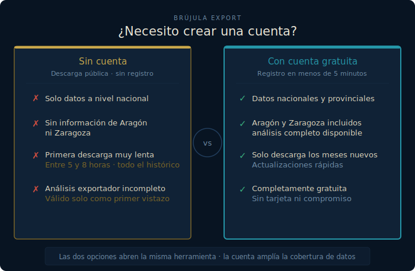

# Brújula Export

**Selección de mercados de exportación con datos oficiales DataComex — 100 % local, sin APIs de pago.**

Escribes un producto (texto o código TARIC) y la herramienta te da un ranking de países con scoring multicriterio, fichas de mercado y la cuota de Aragón/Zaragoza en esa exportación. Genera también un informe imprimible (resumen ejecutivo con los top-5 mercados y cifras clave) que puedes pegar directamente como contexto en cualquier IA externa. Además, todas las gráficas generadas de cada país del score, son exportables a formato PNG y CSV, para poder utilizarlos en presentaciones, archivos Excel, etc.

> *¿Dónde debería exportar este producto?* — eso es lo que responde.

<br>
<div align="center">
  

[](https://github.com/olacambraa-lgtm/brujula-export/actions/workflows/datacomex-liveness.yml)
[](LICENSE)


</div>

<br>

<p align="center">
  
</p>

---

## En un vistazo

| | |
|---|---|
| **100 % local** | Funciona sin conexión; la única acción que usa la red es actualizar los datos, y es manual |
| **Datos oficiales** | DataComex — Secretaría de Estado de Comercio · comercio declarado, ~98 % del total |
| **Scoring transparente** | 6 criterios con pesos ajustables en vivo; normalizados a percentil entre países candidatos |
| **Cuota Aragón/Zaragoza** | Desglose provincial disponible con cuenta gratuita de DataComex |
| **Datos siempre al día** | Ejecutas la actualización cuando quieras y la app refleja lo último publicado |
| **Sin build step** | SPA vanilla JS + ECharts vendorizado; funciona desde cualquier navegador moderno |

---


---

## Primeros pasos

```bash
git clone https://github.com/olacambraa-lgtm/brujula-export
cd brujula-export
python3 -m venv .venv && .venv/bin/pip install -r requirements.txt
```

Configura tu acceso a DataComex (ver sección siguiente) y descarga los datos:

```bash
cp .env.example .env   # pega tus credenciales dentro (ver abajo)
./update-data.sh       # descarga los datos de DataComex
./run.sh               # → http://localhost:8765
```

> ¿Quieres ver cómo funciona antes de registrarte? Ejecuta `./run.sh` directamente: si no hay datos, la app genera un **dataset de demostración** y te avisa con un banner.

---

## Configurar DataComex

La herramienta no incluye datos: cada usuario descarga los suyos con su propia cuenta de DataComex (gratuita). Sin credenciales la app funciona, pero con datos muy limitados — [ver diferencias](#con-cuenta-o-sin-cuenta).

Tienes dos formas de configurar el acceso:

### Opción A: Token (recomendado)

Es la más cómoda. El token es permanente y no hay que renovarlo.

1. **Crea una cuenta gratuita** en <https://datacomex.comercio.es/User> (correo y contraseña). Confirma el correo e inicia sesión.
2. **Obtén tu token:** en la sección de ayuda de la API de DataComex, pulsa **«Obtener Token»** y copia el texto largo que aparece.
3. **Crea tu `.env`** a partir de la plantilla:
   
   ```bash
   cp .env.example .env
   ```
4. Abre `.env` y pega el token en esta línea (quita la `#` del principio):
   
   ```
   DATACOMEX_TOKEN=eyJhbGciOi…tu-token
   ```

### Opción B: Correo y contraseña

Si prefieres no usar el token, puedes poner directamente las credenciales con las que te registraste:
```
DATACOMEX_EMAIL=tucorreo@ejemplo.com
DATACOMEX_PASSWORD=tucontraseña
```

Con cualquiera de las dos opciones, `./run.sh` y `./update-data.sh` cargan el `.env` automáticamente.

> **Privacidad:** tus credenciales viven solo en tu `.env` local, que está en `.gitignore` y nunca se sube al repositorio.

---

<p align="center">
  
</p>

### Con cuenta o sin cuenta

La herramienta está diseñada para usarse **con cuenta gratuita de DataComex**. Sin cuenta también funciona, pero con importantes limitaciones:

**Sin cuenta de DataComex**
La app descarga solo datos nacionales básicos por la vía pública. No hay desglose provincial, así que el análisis de Aragón/Zaragoza desaparece por completo. Si tu objetivo es analizar el potencial exportador de empresas aragonesas, esta opción no tiene mucho sentido.

**Con cuenta gratuita de DataComex** 
Acceso completo: datos nacionales y provinciales (Aragón/Zaragoza), scoring con todos los indicadores, fichas de mercado sin lagunas. Es la versión para la que fue diseñada la herramienta. Registrarse es gratuito y lleva menos de 5 minutos.

Cuando ejecutas `./update-data.sh`, la app descarga solo los meses que le faltan — no empieza de cero cada vez. Para que los datos nuevos aparezcan en la app, reinicia con `./run.sh` (o `./run.sh --update` para actualizar y arrancar en un paso).

> La primera descarga por la vía pública (sin cuenta) baja todo el histórico desde 2015 y puede tardar varias horas por los límites del formulario público (~5-8 h, ~42 MB). Para un primer vistazo más rápido: `./update-data.sh --from 2022-01` (~1,5 h). Un CI opcional ([`datacomex-liveness.yml`](.github/workflows/datacomex-liveness.yml)) avisa si DataComex cambia algo que rompa la extracción.

---

## Guía de instalación paso a paso

> Esta guía está pensada para cualquier persona, aunque no tengas experiencia con programación ni con el Terminal. Sigue los pasos en orden y tendrás la herramienta funcionando en tu ordenador.

---

### Antes de empezar

Necesitas tener instalado **Python 3.11 o superior**. Para comprobarlo, abre el Terminal y escribe:

```bash
python3 --version
```

Si ves un número como `Python 3.11.x` o superior, estás listo. Si no tienes Python, descárgalo desde [python.org](https://www.python.org/downloads/).

---

### ¿Cómo abro el Terminal?

**En Mac:** Pulsa `Cmd ⌘ + Espacio`, escribe `Terminal` y pulsa Intro.

Verás una ventana con texto. Es normal. Aquí pegarás los comandos de esta guía.

> **¿Qué es un comando?** Es una instrucción de texto que le das al ordenador. Copia el bloque de texto, pégalo en el Terminal con `Cmd ⌘ + V` y pulsa **Intro** para ejecutarlo.

---

### Paso 1 — Descarga el proyecto

Copia este bloque completo, pégalo en el Terminal y pulsa Intro:

```bash
git clone https://github.com/olacambraa-lgtm/brujula-export
cd brujula-export
python3 -m venv .venv && .venv/bin/pip install -r requirements.txt
```

El Terminal mostrará texto durante un par de minutos mientras descarga e instala todo. Espera a que aparezca de nuevo el símbolo `$` — eso significa que ha terminado.

---

### Paso 2 — Configura tus credenciales de DataComex

Crea el archivo de configuración a partir de la plantilla:

```bash
cp .env.example .env
nano .env
```

Se abrirá un editor de texto. Aquí tienes que elegir **una sola opción** para autenticarte:

> ⚠️ **Importante:** usa el token **o** el correo y contraseña, nunca los dos a la vez. Si rellenas ambos, el sistema intentará usar el correo/contraseña y puede fallar aunque el token sea válido. Cuando dudes, usa el token: es siempre más fiable.

**Con token** (recomendado) — busca la línea `# DATACOMEX_TOKEN=`, quita el `#` y pega tu token:
```
DATACOMEX_TOKEN=eyJhbGciOi…tu-token-completo-aquí
```
Las líneas de `DATACOMEX_EMAIL` y `DATACOMEX_PASSWORD` deben quedar con `#` delante (inactivas).

**Con correo y contraseña** — rellena las dos líneas correspondientes (usa comillas dobles si tu contraseña tiene caracteres especiales como `!`, `$` o `&`):
```
DATACOMEX_EMAIL="tucorreo@ejemplo.com"
DATACOMEX_PASSWORD="tucontraseña"
```
La línea de `DATACOMEX_TOKEN` debe quedar con `#` delante (inactiva).

Guarda y cierra el editor: pulsa `Ctrl+O` → Intro → `Ctrl+X`.

> **¿El sistema rechaza tus credenciales?** Si aparece el error `Credenciales DataComex rechazadas`, prueba a cambiar al token. Abre de nuevo el archivo con `nano .env`, añade `#` al inicio de las líneas de email y contraseña para desactivarlas, quita el `#` de la línea del token y guarda.

---

### Paso 3 — Descarga los datos oficiales

```bash
./update-data.sh
```

Esto conecta con DataComex y descarga los datos de comercio exterior de España. **La primera vez puede tardar entre 15 minutos y varias horas** según la antigüedad del histórico que se descargue. Verás texto avanzando en el Terminal — es normal, espera hasta que aparezca de nuevo el `$`.

> **¿Se ha cortado la conexión a internet?** No hay problema. Vuelve a ejecutar el mismo comando `./update-data.sh` cuando recuperes la conexión. La descarga es **incremental**: detecta qué archivos ya tiene y continúa exactamente desde donde se quedó, sin empezar de cero.

---

### Paso 4 — Arranca la herramienta

```bash
./run.sh
```

Cuando veas esta línea en el Terminal:

```
Uvicorn running on http://127.0.0.1:8765
```

Abre tu navegador y ve a **http://localhost:8765**. ¡Listo!

> **No cierres el Terminal mientras usas la herramienta.** El servidor necesita estar en marcha. Cuando termines, ciérralo pulsando `Ctrl+C`.

---

### Cómo arrancarla las próximas veces

Cada vez que quieras usar la herramienta, abre el Terminal y ejecuta:

```bash
cd brujula-export
./run.sh
```

Si aparece el error `ya hay un servidor escuchando en :8765`, hay una sesión anterior activa. Ciérrala y vuelve a arrancar con:

```bash
lsof -ti TCP:8765 | xargs kill -9 2>/dev/null; sleep 1; ./run.sh
```

---

### En caso de estar algo perdido...

Siempre puedes consultarle directamente a la IA o a mi personalmente. Utiliza el modelo de lenguaje que más útil te resulte y consultale copiando y pegando la URL del directorio que tienes ahora mismo abierta. Dependiendo del modelo y los permisos que le des puedes hasta pedirle que te lo instale directamente para no tener que hacer nada más que iniciar sesión en Datacomex y compartirle tus credenciales 😉

---

### Actualizar los datos cada mes

DataComex publica datos nuevos mensualmente. Para traer lo último:

```bash
cd brujula-export
./update-data.sh
```

Cuando termine, reinicia la app para que los cambios se apliquen:

```bash
lsof -ti TCP:8765 | xargs kill -9 2>/dev/null; sleep 1; ./run.sh
```

---

## Datos dinámicos

Los datos no van en el repositorio (son grandes y el ministerio los actualiza cada mes): cada usuario los descarga y los mantiene al día con `./update-data.sh`. Cuando DataComex publica un mes nuevo, basta volver a ejecutarlo.

```bash
./update-data.sh   # trae lo último de DataComex y reconstruye la base
./run.sh           # sirve los datos (offline)
```
---

## Arquitectura

| Pieza | Qué hace |
|---|---|
| `etl/` | Descarga DataComex (API oficial con token, o cadena CSV pública) y construye `data/brujula.duckdb` |
| `app/` | FastAPI: motor de scoring (SQL DuckDB + percentiles) y endpoints del [contrato](docs/specs/api-contract.md) |
| `web/` | SPA sin build step (vanilla JS + ECharts vendorizado) — funciona offline |
| `tests/` | pytest: métricas con valores calculados a mano, API y ETL |

Decisiones de arquitectura en `docs/adr/`. Spec completa en `docs/specs/2026-06-11-brujula-export-design.md`.

---

## Scoring

<p align="center">
  
</p>

---

### Criterios de selección

El scoring utiliza 5 componentes normalizados a percentil

<div align="center">
  
| Criterio | Descripción |
|----------|-------------|
| **Tamaño** | Volumen total de importaciones (USD) |
| **Crecimiento** | Tasa anual compuesta últimos 3 años |
| **Estabilidad** | Consistencia en volúmenes (sin caídas bruscas) |
| **Valor unitario €/kg** | Precio promedio y margen potencial |
| **Accesibilidad** | Barreras arancelarias y acuerdos comerciales |

</div>

**Notas:**
- Pesos ajustables en vivo mediante sliders
- Métrica incalculable → componente neutro 50 + flag visible
- Celdas con secreto estadístico → `<n/d>`

---

## Carga de datos reales (avanzado)

`./update-data.sh` (= `python -m etl.update`) hace descarga incremental + reconstrucción en un paso (ver «Datos dinámicos»). Si prefieres controlar cada fase por separado:

```bash
.venv/bin/python -m etl.download --from 2015-01   # descarga reanudable a data/raw/
.venv/bin/python -m etl.load                       # reconstruye data/brujula.duckdb
```

Detalle completo (tiempos, validaciones, vías API/CSV, límites del formulario público): `docs/etl-runbook.md`.

---

## Tests

```bash
.venv/bin/pytest -q
```

---

## Fuente y licencia

**Fuente de datos:** [DataComex](https://datacomex.comercio.es)  
Estadísticas de comercio exterior de bienes de España y la UE

**Código:** licencia [MIT](LICENSE).
