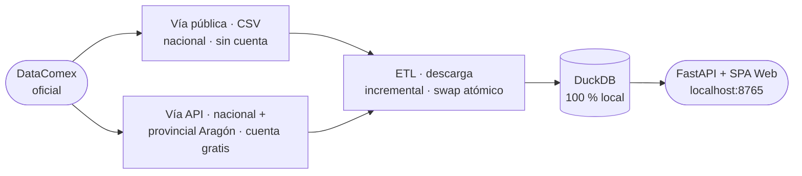

# Brújula Export

**Selección de mercados de exportación con datos oficiales DataComex — 100 % local, sin APIs de pago.**

Escribes un producto (texto o código TARIC) y obtienes al instante un ranking de países objetivo con scoring multicriterio transparente, fichas de mercado por país y la cuota de Aragón/Zaragoza en esa exportación. Genera además un informe imprimible con un resumen ejecutivo determinista (top-5 mercados y cifras clave), copiable para usarlo como contexto en una IA externa — sin llamadas a IA en runtime.

> *Pregunta que responde: **¿dónde debería exportar este producto?***

<br>

[](https://github.com/olacambraa-lgtm/brujula-export/actions/workflows/datacomex-liveness.yml)
[](LICENSE)


<br>

<p align="center">
  
</p>

---

## En un vistazo

| | |
|---|---|
| **100 % local** | Sirve datos sin red; actualizar es la única acción con conexión (y es deliberada) |
| **Datos oficiales** | DataComex — Secretaría de Estado de Comercio · comercio declarado, ~98 % del total |
| **Scoring transparente** | 6 criterios con pesos ajustables en vivo; percentiles normalizados [0-100] entre países candidatos |
| **Cuota Aragón/Zaragoza** | Desglose provincial incluido con cuenta gratuita DataComex |
| **Actualización incremental** | Swap atómico: un fallo de red nunca deja la base a medias |
| **Sin build step** | SPA vanilla JS + ECharts vendorizado; funciona desde cualquier navegador moderno |

---

## Primeros pasos

```bash
git clone https://github.com/olacambraa-lgtm/brujula-export
cd brujula-export
python3 -m venv .venv && .venv/bin/pip install -r requirements.txt
```

Luego configura tu acceso a DataComex (ver **[Configurar DataComex](#configurar-datacomex-cuenta-y-token)**) y descarga los datos:

```bash
cp .env.example .env   # pega tu token de DataComex dentro (ver sección siguiente)
./update-data.sh       # con cuenta: nacional + Aragón · sin cuenta: solo nacional
./run.sh               # → http://localhost:8765
```

¿Solo quieres echar un vistazo sin registrarte? Ejecuta `./run.sh` directamente: si no hay datos, genera un dataset **sintético de demostración** (la app lo avisa con un banner) para que veas la interfaz al instante.

---

## Configurar DataComex (cuenta y token)

Esta herramienta es el **motor**: los datos los trae cada usuario con su propia cuenta gratuita de DataComex. Para tener **todas las funciones**, incluido el desglose provincial de Aragón, necesitas un token personal:

1. **Crea una cuenta gratuita** en <https://datacomex.comercio.es/User> (correo y contraseña). Confirma el correo e inicia sesión.
2. **Consigue tu token:** en la página de ayuda de la API de DataComex, pulsa el botón **«Obtener Token»** y copia el texto largo que aparece (es tu token personal, tipo JWT).
3. **Crea tu archivo `.env`** a partir de la plantilla incluida:
   ```bash
   cp .env.example .env
   ```
4. **Abre `.env`** con cualquier editor de texto y pega el token, quitando la almohadilla `#` del principio de esa línea:
   ```
   DATACOMEX_TOKEN=eyJhbGciOi…tu-token
   ```
   *(Alternativa: en vez del token, pon tu correo y contraseña en `DATACOMEX_EMAIL=` y `DATACOMEX_PASSWORD=`.)*
5. **Guarda el archivo.** Ya está: `./run.sh` y `./update-data.sh` cargan `.env` automáticamente.

> **¿Sin cuenta?** También funciona: `./update-data.sh` sin `.env` baja los datos **nacionales** por la vía pública (sin registro), pero las cuotas provinciales de Aragón saldrán vacías.
>
> **Privacidad:** tu token vive solo en tu `.env` local, que está en `.gitignore` y **nunca** se sube al repositorio.

---

## Datos dinámicos

Los datos NO van en el repo (son grandes y cambian cada mes): cada usuario los descarga y los mantiene al día contra **DataComex** de forma independiente. Cuando el ministerio publica un mes nuevo, basta volver a ejecutar la actualización y la app lo refleja.

```bash
./update-data.sh          # trae lo último de DataComex y reconstruye la base
./run.sh                  # sirve los datos (offline)
```

### Flujo de datos



### Modos de acceso

- **Sin cuenta** (cualquiera): vía CSV pública → datos **nacionales** de todo el histórico (ene 2015 → último mes publicado).
- **Con cuenta gratuita** de DataComex (añade el desglose **provincial** de Aragón): pon tu token en `.env` — ver [Configurar DataComex](#configurar-datacomex-cuenta-y-token).

La actualización es **incremental e idempotente** y con **cortocircuito «ya al día»**: tras la primera construcción (la más larga), cada ejecución solo trae los meses que falten; si ya está al día, no descarga nada. La reconstrucción usa **swap atómico**, así que un fallo de red nunca deja la base a medias; tras actualizar, reinicia la app (`./run.sh`) para servir los datos nuevos. `./run.sh --update` actualiza y arranca en un paso. La app sigue siendo **100 % offline** al servir: actualizar es la única acción que usa la red y es deliberada (ver [ADR-006](docs/adr/ADR-006-datos-dinamicos.md)).

> La **primera** descarga por la vía pública (sin cuenta) baja todo el histórico nacional: tarda ~5-8 h por el *rate-limit* del formulario, aunque el volumen es pequeño (~42 MB). Para un primer vistazo rápido: `./update-data.sh --from 2022-01` (~1,5 h, últimos años). La incrementalidad vive en `data/raw/`: tras la primera descarga, cada actualización solo trae el mes nuevo. Un CI opcional, [`datacomex-liveness.yml`](.github/workflows/datacomex-liveness.yml) (mensual, sin secretos), avisa a los *forks* si DataComex cambia y rompe la cadena de extracción.

---

## Arquitectura

| Pieza | Qué hace |
|---|---|
| `etl/` | Descarga DataComex (API oficial con token, o cadena CSV pública) y construye `data/brujula.duckdb` |
| `app/` | FastAPI: motor de scoring (SQL DuckDB + percentiles) y endpoints del [contrato](docs/specs/api-contract.md) |
| `web/` | SPA sin build step (vanilla JS + ECharts vendorizado) — funciona offline |
| `tests/` | pytest: métricas con valores calculados a mano, API y ETL |

Decisiones de arquitectura en `docs/adr/`. Spec completa en `docs/specs/2026-06-11-brujula-export-design.md`.

---

## Scoring

<p align="center">
  
</p>

Seis componentes por país, normalizados a percentil [0-100] entre los destinos candidatos del producto: **tamaño** (25 %), **crecimiento CAGR 3a** (25 %), **estabilidad** (15 %), **valor unitario €/kg** (15 %), **espacio competitivo €/operador** (10 %), **accesibilidad UE/acuerdos** (10 %). Los pesos se ajustan en vivo con sliders. Métrica incalculable → componente neutro 50 + flag visible; celdas con secreto estadístico → «n/d», nunca 0; datos 2024+ marcados como provisionales hasta la UI.

---

## Carga de datos reales (avanzado)

`./update-data.sh` (= `python -m etl.update`) hace descarga incremental + reconstrucción en un paso (ver «Datos dinámicos»). Si prefieres controlar cada fase por separado:

```bash
.venv/bin/python -m etl.download --from 2015-01   # descarga reanudable a data/raw/
.venv/bin/python -m etl.load                       # reconstruye data/brujula.duckdb
```

Detalle completo (tiempos, validaciones, vías API/CSV, límites del formulario público): `docs/etl-runbook.md`.

---

## Tests

```bash
.venv/bin/pytest -q
```

---

## Fuente y reutilización

Datos: DataComex — Secretaría de Estado de Comercio (comercio declarado, ~98 % del total). Uso interno/demostrativo con cita de fuente y fecha, conforme a las condiciones generales de reutilización ministeriales. No redistribuir datos derivados comercialmente sin confirmación escrita del titular.

## Licencia

Código bajo licencia [MIT](LICENSE). La licencia cubre el código, no los datos de DataComex (que mantienen sus propias condiciones de reutilización y no se redistribuyen con el repo). Para configurar tus credenciales de DataComex, ver [Configurar DataComex](#configurar-datacomex-cuenta-y-token) y [`.env.example`](.env.example).
